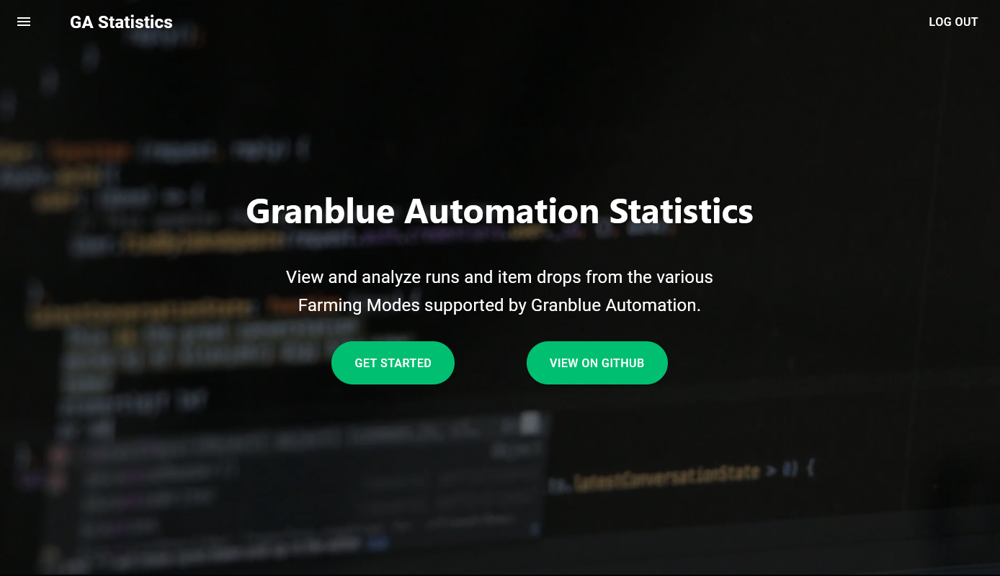
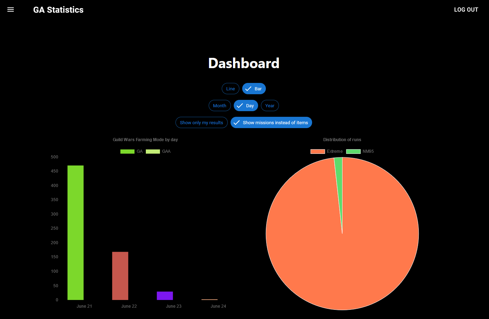

# Granblue Automation Statistics

    

> https://granblue-automation-statistics.com/

> Checkout the associated projects of [Granblue Automation](https://github.com/steve1316/granblue-automation-pyautogui) and [Granblue Automation Android](https://github.com/steve1316/granblue-automation-android)

<p align="center">
    
    
</p>

Granblue Automation Statistics aims to provide users who choose to opt-in valuable information regarding which Farming Modes and Raids have been popular with what and how many item drops the user and others have been getting.

How it works is every time the Loot Collection process detects 1 or more item drops after a run, it will send a POST request to the MongoDB cluster and add a new entry into the specific Item table with the various information such as item name, amount it acquired, and how long it took.

Back to the website, you can choose to display all runs provided by opt-in users for a particular Farming Mode's item in a table, display it as a chart, and sort/filter the results. The results are also displayed charts for visual representation.

## Disclaimer

Information collected by Granblue Automation Statistics do not contain any personal identifiable information.

# Features

-   Create an account to login and use in both GA/GAA to send run results via the website's API.
-   Displays results in charts for visual representation.
-   Displays results in a table for easy sort/filter.

# Build Instructions

1. Open a terminal in the root of the project and run `yarn install` to install the frontend Javascript dependencies.
2. Run `yarn install` in the `/backend/` folder as well to install the backend Node/Express dependencies.
3. Create a `.env` file in the `/backend/` folder with the following information:

```
MONGODB_USERNAME=
MONGODB_PASSWORD=
MONGODB_URI=

EXPRESS_SESSION_SECRET=

JWT_SECRET=

EMAIL=
EMAIL_PASSWORD=
```

The URI for the MongoDB cluster can be found when you create one. The secrets can be anything. The last part of the .env is used to send a password reset email using an email service hosted on your server.

4. Create a `.env` file in the root of the project with the following information:

```
REACT_APP_ENVIRONMENT=
```

Set the enviroment to "development" to force the React project to use the localhost entrypoints instead of the website's.

5. Now you can run/build the project by running `yarn start` in both the `/backend/` folder to start the localhost server and in the root of the project to start a localhost version of the website.
