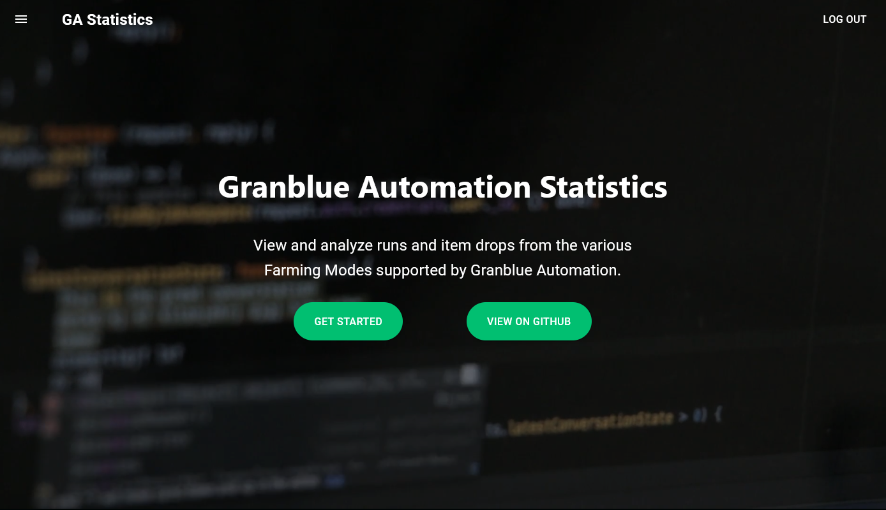
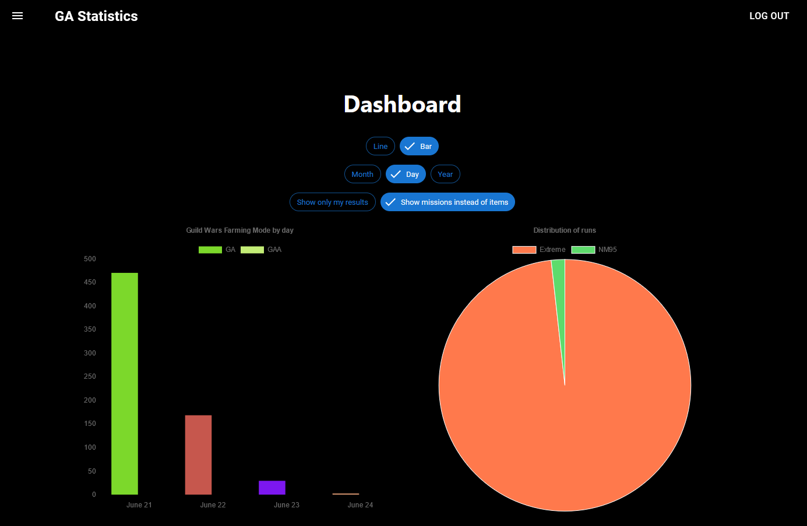

# Granblue Automation Statistics

    

> https://granblue-automation-statistics.com/

> Checkout the associated projects of [Granblue Automation](https://github.com/steve1316/granblue-automation-pyautogui) and [Granblue Automation Android](https://github.com/steve1316/granblue-automation-android)

<p align="center">
    
    
</p>

Granblue Automation Statistics aims to provide users who choose to opt-in valuable information regarding which Farming Modes and Raids have been popular with what and how many item drops the user and others have been getting.

Every time the Loot Collection process in GA/GAA detects one or more item drops after a run, it sends the result to this site's API, which stores it in MongoDB with information such as the item name, the amount acquired, and how long the run took. On the website, you can display all runs provided by opt-in users for a particular Farming Mode's item as a sortable/filterable table or as charts for visual representation.

See the [`/about`](https://granblue-automation-statistics.com/about) page for a walkthrough of how opting in works.

## Disclaimer

Information collected by Granblue Automation Statistics does not contain any personally identifiable information.

## Features

-   Create an account to log in and use in both GA/GAA to submit run results via the website's API.
-   Displays results as charts for visual representation.
-   Displays results in a table for easy sorting/filtering.
-   Password recovery by email, sent through a self-hosted mail server.

## Tech stack

-   **Frontend** (repository root) - React 19, Material UI 9, and Chart.js, built with Vite 8.
-   **Backend** (`/backend`) - Express 5 with Passport authentication and Mongoose 9 talking to MongoDB.
-   **Mail** (`/mail`) - a self-hosted Postfix server that sends the password-recovery emails.
-   **Runtime** - Node 22, with the whole stack deployable through Docker Compose.

## Running with Docker (recommended)

The entire stack runs from the root `docker-compose.yml` (frontend, backend, and mail server):

1. Create the environment files described in [Environment variables](#environment-variables) - `backend/.env`, `.env.production`, and `mail/.env`.
2. From the project root, build and start everything:

```
docker compose up --build
```

The frontend is served at http://localhost:5173 and the backend API at http://localhost:4000. See [`mail/README.md`](mail/README.md) for the DNS records the mail server needs to deliver email.

## Local development

1. Use Node 22 (e.g. `nvm install 22 && nvm use 22`).
2. Install dependencies in both the root and `/backend`:

```
yarn install
cd backend && yarn install
```

3. Provide a MongoDB connection string in `backend/.env` (a local instance or a MongoDB Atlas cluster) and the frontend's `.env.development` (already set to `http://localhost:4000`).
4. Start each side in its own terminal:

```
yarn start              # frontend (Vite dev server on :5173)
cd backend && yarn start # backend (tsx watch on :4000)
```

## Environment variables

**`backend/.env`** - the backend loads these via dotenv:

```
MONGODB_URI=              # MongoDB connection string
EXPRESS_SESSION_SECRET=   # any random string
JWT_SECRET=               # any random string, used for password-reset tokens
EXPRESS_PORT=4000

# SMTP - defaults below point at the mail service from docker-compose.
SMTP_HOST=mail
SMTP_PORT=587
SMTP_SECURE=false
# Optional: set EMAIL/EMAIL_PASSWORD instead to send through an authenticated external SMTP server.
```

**Frontend** - `.env.development` and `.env.production` each define `VITE_API_URL`, which is the backend entry point the site talks to:

```
# .env.development
VITE_API_URL=http://localhost:4000

# .env.production
VITE_API_URL=https://granblue-automation-statistics.com
```

**`mail/.env`** - the mail server's configuration. Copy `mail/.env.example` and follow [`mail/README.md`](mail/README.md) for the DKIM and DNS setup.

All `.env` files are gitignored - never commit real credentials.
